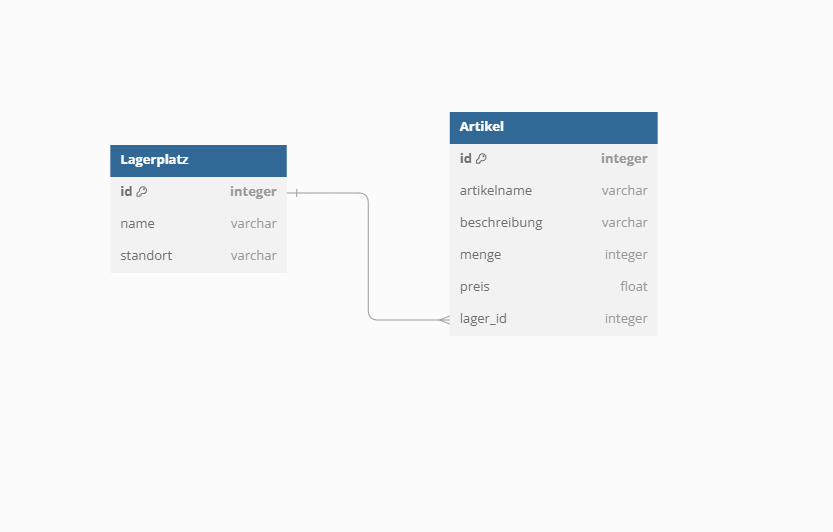

# Lagerverwaltung
## Datenbank
### Diagramm

Table Lagerplatz {
  id integer [primary key]
  name varchar
  standort varchar 
}

Table Artikel {
  id integer [primary key]
  artikelname varchar
  beschreibung varchar
  menge integer
  preis float
  lager_id integer
}

Ref: Artikel.lager_id > Lagerplatz.id // many-to-one

